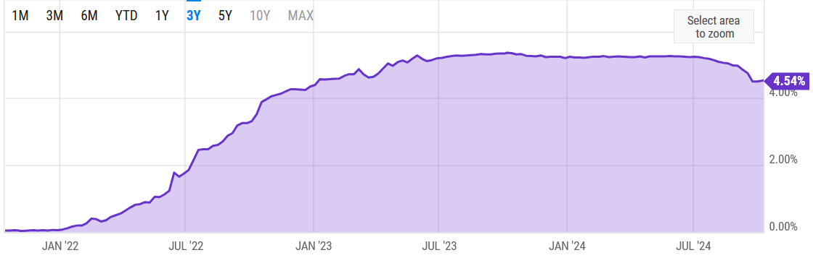
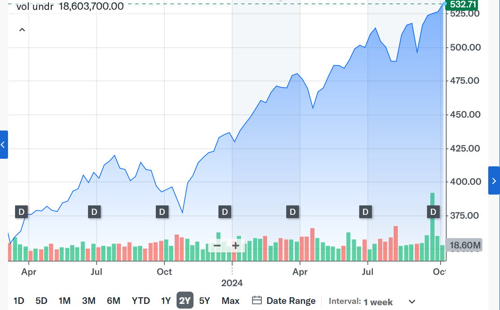

<!-- https://www.citi.com/credit-cards/citi-custom-cash-credit-card -->

I've been looking into new credit cards recently. With the combination of 0% APR introductory periods and bonuses for spending small sums of money I saw a low effort opportunity for arbitrage.

It seems basically like free money right? So I decided to experiment a little and see if it's actually worth it.

Here are the terms for the card I was looking at:
- $25K limit
- 0% APR for 15 months
- $200 after spending $1500
- minimum payment: flat fee or 1% (will be 1% in this case)
- 5% cash back on top category each, only works on first $500 spent
- 1% cash back for all other purchases
- no annual fee

## Picking An Investment

First of all, the most important part, is to pick where to put this $25k. In other words how much risk am I willing to take on?

In this case, my appetite for risk is extremely low, especially since there are some perfectly good risk-free investment options available. I'll be going with [3 Month Treasury Bills](https://www.investopedia.com/terms/t/treasurybill.asp).[^1]

For the sake of making calcuations easy I'll be assuming a flat %5.1 over 15 months(April 2023 to July 2024). Realistically it's a bit higher but it doesn't matter much.

Another option, assuming I was willing to take on some risk would have been to put the money in [VOO](https://finance.yahoo.com/quote/VOO/) instead which tracks the S&P 500. For the same time period above it would have returns about 33%. Remember though, this involves some added risk so it's not exactly "free money".

## Arbitrage

Ok, now that I've picked where I'll be putting the money, lets see how to maximize my returns.

The general strategy is to max out the card and instead of paying it off I would instead keep the money in 3 month treasuty bills. Also, ideally I would try to maximize rewards and cash back at the same time.

Step one is to max out the card. First of all, since I spent $1,500 I would get $200 right off the bat. Then from the cash back, I would get 5% back on $500 and %1 back on the remaining $24,500.[^2] 

This comes out to a total of (0.05 \* $500) + (0.01 \* $24500) + $200 = $470.

Also, the interest from 15 months of 3 month treasury bills, assuming a flat 5.1%, would be the following: $25,000 \* 0.051 \* 15/12 = $1,593.75.

That's $1,593.75 + $470 = $2,063.75 in total! It's basically free as well.

## Minimum Payments

There is one thing I overlooked so far. Even though there's a 15 month 0% APR period, I still need to make the minimum payments. For this card the minimum is 1% per month or a flat fee, whichever is higher. In this case the 1% is definitely higher since we're keeping the card basically maxed out.

Over the course of the whole 15 months, with the help of the finite geometric series formula, I know I need to spend ($25,000\*0.01)\*((1-0.99^(15))/(1-0.99))=$3,498.75 on the monthly minimum payments.

To remedy this, I could buy 3 or 4 less treasury bills across the time period, and use my cash back rewards for some payments, or use other income to subsidize this. Assuming I didn't use other income I would profit somewhere around $200 less, but that's just a quick estimate. In this case I'll use other income though.

## Conclusion

I made a profit of $2,063.75, and basically didn't have to do anything. Risk free!

If I had a higher risk tolerance that could have been 25000 \* 0.33 \* 15/12 = $10,312.50.

## Notes

[^1]: Just for completeness, it's also possible to get better risk-free returns from CDs or even some HYSAs. I decided to stick with T Bills for this though.

[^2]: You may be thinking that I can actually make a bit more money by simply delaying some of my purchases a single month in order to get 5% cash back. This is true, but the returns would be almost neglible because it would also delay my purchase for another treasury bill. In other words while I would earn more cash back I would also be losing out on interest at the same time.