NOTE: This is still a Work In Progress... At the moment this is mostly just an outline.

Continuing on with the commit log I started in [Part 1](jcc_p1.html).

I also wrote an entire detailed report on topics learned while making these commits [here](/res/final_report.pdf), but this will be much more approachable.


## Commits 26-27

Big Backend Refactor, especially for x86\_64:

- Merge returns and fix prolog/epilog in x86\_64
- Start following windows ABI more closely for x86\_64 backend
- Start using State(def/use/kill) for machine instruction operands
- Implemented br, brz, brnz in x86\_64 and interp backends
- Add "id" IROp.
- Minor fixes for module-wide regalloc

One of the major goals for the whole backend refactor over the past few commits was delaying register allocation until later in the pipeline. So now, instead of register allocation being done on JBIR and before generating MCIR, now it is done before Machine Code Generation. 


Also added liveness analysis.
Implemented basic-block-level liveness analysis.

Example C code:
```
int main () {
  int x = 17;
  int y = 6;
  int z = 0;
  if ( y < x )
    z = x + y ;
  return z + x ;
}
```

Equivalent JBIR:
```
[ win64 ]
fn main() %0:i32
entry:
  %1 = id 17.i32
  %2 = id 6.i32
  %3 = id 0.i32
  %4 = lt %2, %3
  brz %4 then cont
then:
  %5 = iadd %1, %2
  br cont
cont:
  %6 = phi [entry, %3], [then, %5]
  %7 = iadd %6, %1
  ret %7
```

Liveness analysis results:
```
entry:
  livein:
  liveout: 3 1 2
then:
  livein: 1 2
  liveout: 5 1 3
cont:
  livein: 1 3 5
  liveout:
```

## Commits 28-31

Add Mem2Reg Pass.

Original JBIR:
```
fn main() %0:i32
entry:
%1 = slot i32
stack_store %1, 100.i8
brnz 1.i32 first second
first:
br last
second:
stack_store %1, 42. i8
br last
last:
%4 = stack_load %1 i32
ret %4
```

JBIR after Mem2Reg:
```
fn main() %0:i32
entry:
noop
%1000 = id 100.i8
brnz 1.i32 first second
first:
br last
second:
%1001 = id 42.i8
br last
last:
%4 = phi [first, %1000], [second, %1001]
ret %4
```

Also, some small additions/changes.

## Commits 32-34

Passes for Control Flow Graph Creation and Visualization.
(TODO: Insert example image here)

## Commits 35-37

Pass for PhiElim(aka Static Single Assignment(SSA) Deconstruction).

Original JBIR:
```
fn main() %0: i32
b1:
%1 = id 0.i32
br b2
b2:
%2 = phi [b1, %1], [b2, %3]
%3 = iadd %2, 1.i8
%4 = id 5.i32
%5 = lt %2, %4
brnz %5 b2 b3
b3:
ret %2
```

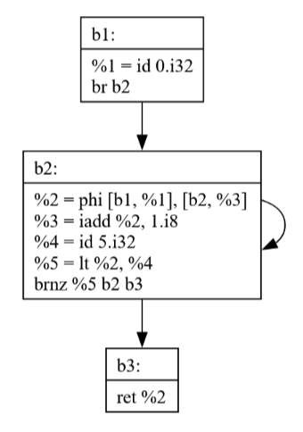

After PhiElim, notice how a critical edge is necessarily broken so code can be generated correctly.
```
fn main() %0: i32
b1:
%1 = id 0.i32
%302 = mov %1
br b2
crit_0:
%302 = mov %3
br b2
b2:
%2 = mov %302
%3 = iadd %2, 1.i8
%4 = id 5. i32
%5 = lt %2, %4
brnz %5 crit_0 b3
b3:
ret %2
```

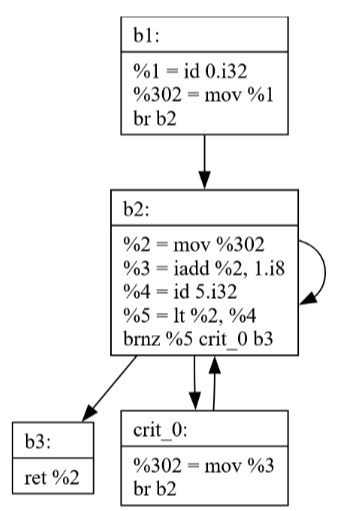

Notice how there's an extra edge from *b2* to itself in the diagram though. This just means I left a dead edge in some data structure somewhere. I never would have noticed this if I didn't spend time making this visualization.

## Commit 38

Dead Code Elimination(DCE) Pass.

the entry node for this function is *b1*, so the *b2* block is dead, there’s no possible way to reach it during normal program flow.
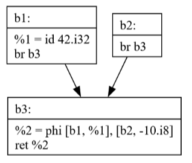

Notice how *b2* is no longer present.
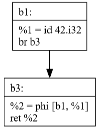

## Commit 39

Sparse Simple Constant Propagation(SSCP) Pass.

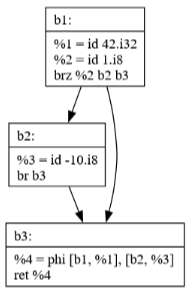

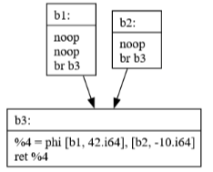

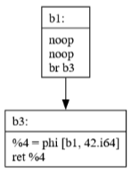

## Commit 40

JBIR Generation.

```
int main () {
  int a = 0;
  for (int i = 0; i < 10; i ++) {
    if (i % 2 == 0)
      a += i;
    else
      a -= 1;
  }
  return a ;
}
```
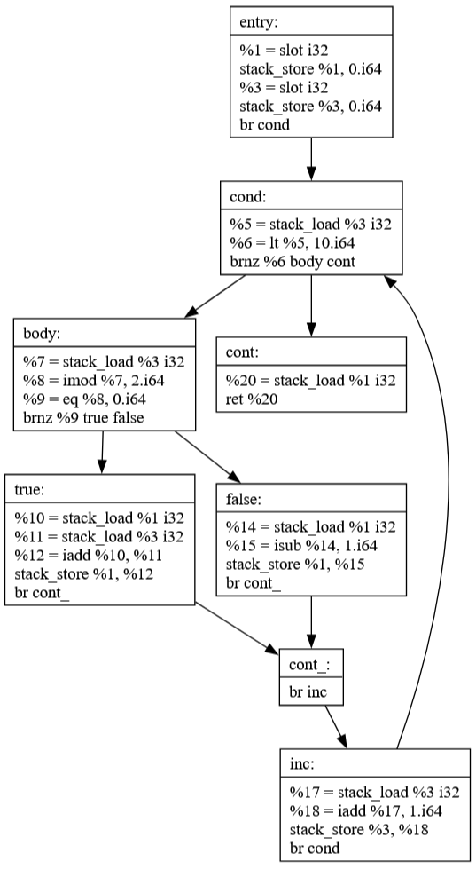

## Commit 41

Global Value Numbering(GVN) Pass.

## Commit 42

Peephole Pass.

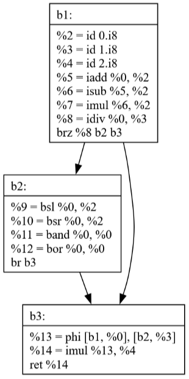

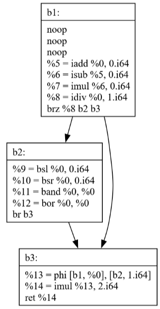

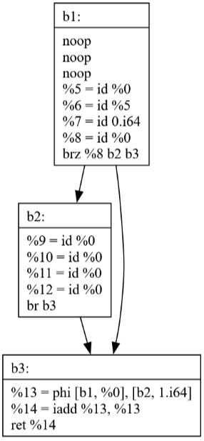

## Commits 43-44

Loop-Invariant Code Motion(LICM) Pass.

```
int main () {
  int a = 0, b = 0;
  int c1 = 15 , c2 = 5;
  for (int i = 0; i < 10; ++i) {
    a += i;
    b = c1 + c2;
  }
  return a + b;
}
```

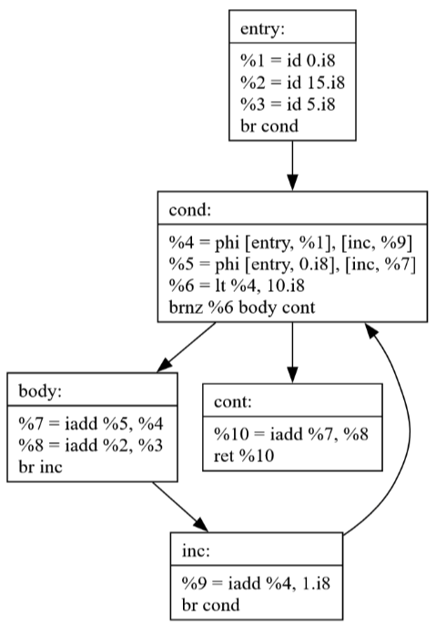

If the loop condition is always false the loop-invariant code pulled into the entry block would never
have executed previously, but now it does. This is not correct.

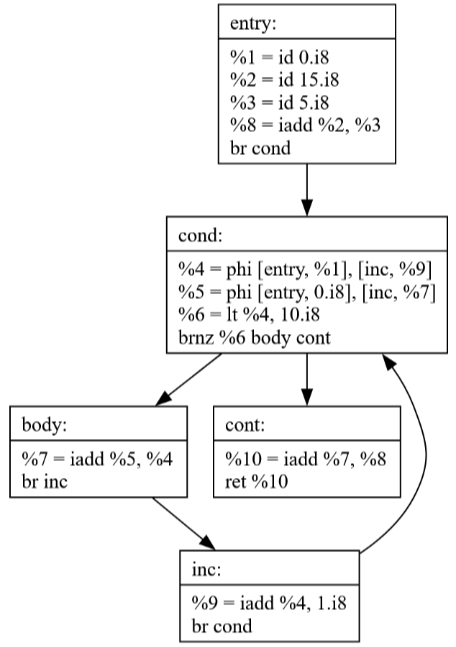

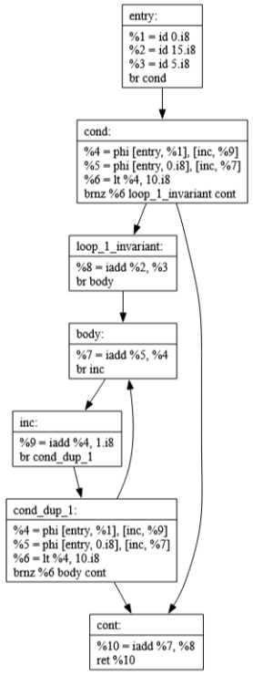

## Commits 45-47

Inlining Pass.
CFG Cleanup Pass.

```
int add (int lhs, int rhs ) {
  return lhs + rhs;
}
int main () {
  return add (3 , 39);
}
```

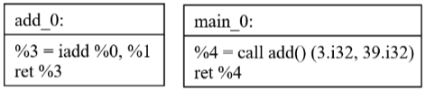

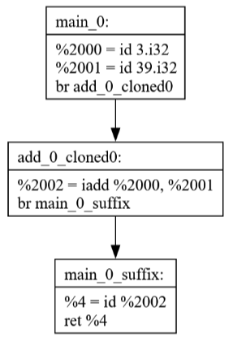

After running a cleanup pass then SSCP it simplifies down to a single constant.
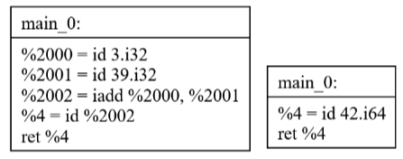

## Commits 48-49

Pass Management.
Previously I was manually running passes until a fixed point for specific pieces of code to test.

Here is an example of the new pass management code.
```
bool changed;
do {
  changed = false;
  changed |= SSCP::run_pass(f);
  CreateCFG::run_pass(f);
  CFGViz::run_pass(f);

  changed |= DCE::run_pass(f);
  CreateCFG::run_pass(f);
  CFGViz::run_pass(f);

  changed |= Cleanup::run_pass(f);
  CreateCFG::run_pass (f);
  CFGViz::run_pass(f);
} while(changed);
```

## Commits 50-51

Instruction Encoding for x86\_64.

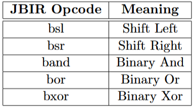

## Commits 52-54

Array Support.
Escape Sequences.

Taking inspiration from the example program on Day 15 of [Rui's C Compiler Blog Post](https://www.sigbus.info/how-i-wrote-a-self-hosting-c-compiler-in-40-days#day15) I created the code below for solving the [Eight Queens Puzzle](https://en.wikipedia.org/wiki/Eight_queens_puzzle).
I took special care to make sure it avoids unimplemented features, there's a few obvious workarounds that you may be able to see. However, even then, there's still some minor issue preventing it from working. After a few iterations it ends up crashing. That means there's still more work to do then!

```
#include <stdbool.h>
extern int printf(char*);

void print_board(int *board) {
  for (int i = 0; i < 8; i++) {
    for (int j = 0; j < 8; j++) {
      if (board[i * 8 + j] == 1)
        printf("Q ");
      else
        printf(". ");
    }
    printf("\n");
  }
  printf("\n\n");
  return;
}

bool conflict(int *board, int row, int col) {
  for (int i = 0; i < row; i++) {
    if (board[i * 8 + col] == 1)
      return true;

    int j = row - i;
    if ((col - j) >= 0)
        if(board[i * 8 + (col - j)] == 1)
            return true;

    if ((col + j) < 8)
        if(board[i * 8 + (col + j)] == 1)
            return true;
  }
  return false;
}

int solve(int *board, int row) {
  if (row == 8) {
    print_board(board);
    return 1;
  }
  int solutions = 0;
  for (int i = 0; i < 8; i++) {
    if (conflict(board, row, i) == false) {
      board[row * 8 + i] = 1;
      solutions += solve(board, row + 1);
      board[row * 8 + i] = 0;
    }
  }
  return solutions;
}

int main() {
  int board[64];
  int *board_ptr = board;
  for (int i = 0; i < 64; i++) {
    board[i] = 0;
  }
  solve(board_ptr, 0);
}
```