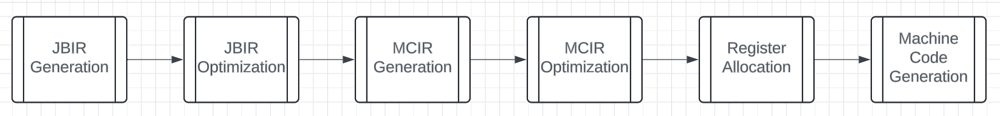

NOTE: This is still a Work In Progress... At the moment this is mostly just an outline.

Continuing on with the commit log I started in [Part 1](jcc_p1.html).

I also wrote an entire detailed report on topics learned while making these commits [here](/res/final_report.pdf), but this will be much more approachable.


## Commits 26-27: Backend Refactoring and Control Flow

<!-- These commits represent a major restructuring of the compiler's backend, particularly focusing on the x86\_64 target. The main goal was to improve the register allocation by moving it later in the compilation pipeline. This change allows for better optimization opportunities before registers are assigned. -->

Key improvements included:
- Better handling of function returns and proper setup/cleanup code (prolog/epilog) in x86\_64
- Stricter adherence to the Windows x86\_64 ABI for better compatibility
- Introduction of State tracking for machine instructions to model register definitions, uses, and kills
- Implementation of branch instructions (br, brz, brnz) in both x86\_64 and interpreter backends
- Addition of an "id" operation for identity assignments
- Enhanced module-wide register allocation

One of the major goals for the whole backend refactor over the past few commits was delaying register allocation until later in the pipeline. So now, instead of register allocation being done on JBIR and before generating MCIR, now it is done before Machine Code Generation. 



Also implemented basic-block-level liveness analysis.

Example C code:
```
int main () {
  int x = 17;
  int y = 6;
  int z = 0;
  if ( y < x )
    z = x + y ;
  return z + x ;
}
```

Equivalent JBIR:
```
[ win64 ]
fn main() %0:i32
entry:
  %1 = id 17.i32
  %2 = id 6.i32
  %3 = id 0.i32
  %4 = lt %2, %3
  brz %4 then cont
then:
  %5 = iadd %1, %2
  br cont
cont:
  %6 = phi [entry, %3], [then, %5]
  %7 = iadd %6, %1
  ret %7
```

Liveness analysis results:
```
entry:
  livein:
  liveout: 3 1 2
then:
  livein: 1 2
  liveout: 5 1 3
cont:
  livein: 1 3 5
  liveout:
```

## Commits 28-31: Memory to Register Promotion

The Mem2Reg pass is a crucial optimization that promotes stack-allocated variables to registers where possible. This transformation is particularly important because:
- It reduces memory access operations which are slower than register operations
- It enables further optimizations by making value flow more explicit
- It helps create proper SSA (Static Single Assignment) form

The example shows how stack loads and stores are eliminated in favor of direct value propagation through registers. The phi nodes are introduced to handle control flow merges properly.

Original JBIR:
```
fn main() %0:i32
entry:
%1 = slot i32
stack_store %1, 100.i8
brnz 1.i32 first second
first:
br last
second:
stack_store %1, 42. i8
br last
last:
%4 = stack_load %1 i32
ret %4
```

JBIR after Mem2Reg:
```
fn main() %0:i32
entry:
noop
%1000 = id 100.i8
brnz 1.i32 first second
first:
br last
second:
%1001 = id 42.i8
br last
last:
%4 = phi [first, %1000], [second, %1001]
ret %4
```

Also, some small additions/changes.

## Commits 32-34: Control Flow Analysis

These commits introduced capabilities for analyzing and visualizing program control flow. The Control Flow Graph (CFG) creation pass builds an explicit representation of how blocks of code are connected, which is essential for:
- Understanding program structure
- Enabling control-flow-based optimizations
- Debugging and visualization
- Validating correctness of transformations

(TODO: Insert example image here)


## Commits 35-37: SSA Deconstruction

The PhiElim pass handles the complex task of converting code out of SSA form. This is necessary because while SSA is great for optimization, actual hardware can't directly execute phi nodes. The pass:
- Converts phi nodes into explicit moves
- Handles critical edges by splitting them when necessary
- Ensures correct value propagation across control flow paths

Original JBIR:
```
fn main() %0: i32
b1:
%1 = id 0.i32
br b2
b2:
%2 = phi [b1, %1], [b2, %3]
%3 = iadd %2, 1.i8
%4 = id 5.i32
%5 = lt %2, %4
brnz %5 b2 b3
b3:
ret %2
```
The example demonstrates how a phi node gets converted into explicit move operations, with special handling of critical edges to maintain correctness.


After PhiElim, notice how a critical edge is necessarily broken so code can be generated correctly.
```
fn main() %0: i32
b1:
%1 = id 0.i32
%302 = mov %1
br b2
crit_0:
%302 = mov %3
br b2
b2:
%2 = mov %302
%3 = iadd %2, 1.i8
%4 = id 5. i32
%5 = lt %2, %4
brnz %5 crit_0 b3
b3:
ret %2
```


Notice how there's an extra edge from *b2* to itself in the 
diagram though. This just means I left a dead edge in some 
data structure somewhere. I never would have noticed this if 
I didn't spend time making this visualization.

## Commit 38: Dead Code Elimination

The Dead Code Elimination(DCE) pass removes code that can never be executed, improving both code size and clarity. The visualization shows:
- How unreachable blocks are identified
- The effect of removing dead code on the program's structure
- The importance of control flow analysis for optimization


Notice how *b2* is no longer present.

## Commit 39: Sparse Simple Constant Propagation

SSCP is a powerful optimization that:
- Identifies values that are constant at compile time
- Propagates these constants through the program
- Enables further optimizations by revealing more constant values
- Works efficiently by only analyzing relevant parts of the program


## Commit 40: JBIR Generation

This commit focuses on generating the compiler's intermediate representation (JBIR) from source code. The example demonstrates how high-level control structures like loops and conditionals are transformed into a more primitive form that's easier to analyze and optimize.

```
int main () {
  int a = 0;
  for (int i = 0; i < 10; i ++) {
    if (i % 2 == 0)
      a += i;
    else
      a -= 1;
  }
  return a;
}
```


## Commit 41: Global Value Numbering

The Global Value Numbering(GVN) pass identifies computations that produce the same value and eliminates redundant calculations. This optimization:
- Reduces code size
- Improves execution speed
- Identifies common subexpressions
- Works across basic blocks

## Commit 42: Peephole Optimization

The Peephole optimization pass looks at small sequences of instructions and replaces them with more efficient alternatives. The visualizations show how:
- Simple patterns are identified and optimized
- Multiple passes can work together (SSCP + Peephole)
- Local optimizations can have significant impact


## Commits 43-44: Loop Optimization

The Loop-Invariant Code Motion pass(LICM) identifies calculations that don't need to be repeated in loops and moves them outside. This optimization:
- Reduces redundant computations
- Must preserve program semantics
- Requires careful handling of execution conditions
- Can significantly improve performance for loops

```
int main () {
  int a = 0, b = 0;
  int c1 = 15 , c2 = 5;
  for (int i = 0; i < 10; ++i) {
    a += i;
    b = c1 + c2;
  }
  return a + b;
}
```


If the loop condition is always false the loop-invariant code 
pulled into the entry block would never
have executed previously, but now it does. This is not 
correct.


## Commits 45-47: Function Inlining and Cleanup

These commits implement function inlining, which replaces function calls with the actual function body. The example shows how:
- Simple function calls can be completely eliminated
- Multiple optimization passes work together
- Complex operations can be reduced to constants
- Code cleanup helps maintain simplicity
```
int add (int lhs, int rhs ) {
  return lhs + rhs;
}
int main () {
  return add (3 , 39);
}
```


After running a cleanup pass then SSCP it simplifies down to 
a single constant.

## Commits 48-49: Optimization Pipeline

These commits introduce a more structured approach to running optimization passes. The new pass management system:
- Ensures passes are run in the correct order
- Handles dependencies between passes
- Repeats optimizations until no more improvements can be made
- Maintains consistency of program representation
Pass Management.
Previously I was manually running passes until a fixed point 
for specific pieces of code to test.

## Commits 50-51: x86\_64 Instruction Encoding

Here is an example of the new pass management code.
```
bool changed;
do {
  changed = false;
  changed |= SSCP::run_pass(f);
  CreateCFG::run_pass(f);
  CFGViz::run_pass(f);

  changed |= DCE::run_pass(f);
  CreateCFG::run_pass(f);
  CFGViz::run_pass(f);

  changed |= Cleanup::run_pass(f);
  CreateCFG::run_pass (f);
  CFGViz::run_pass(f);
} while(changed);
```

## Commits 50-51

Instruction Encoding for x86\_64.

This work focuses on the final stage of compilation where JBIR instructions are converted to actual machine code. The instruction table shows:
- How abstract operations map to concrete instructions
- The complexity of x86\_64 instruction encoding
- The importance of proper instruction selection


## Commits 52-54: Language Feature Expansion

These final commits add support for arrays and string escape sequences, demonstrated through an implementation of the Eight Queens Puzzle. While the implementation isn't yet perfect, it showcases:
- Array handling capabilities
- String processing features
- Complex control flow
- Real-world algorithm implementation

Taking inspiration from the example program on Day 15 of [Rui's C Compiler Blog Post](https://www.sigbus.info/how-i-wrote-a-self-hosting-c-compiler-in-40-days#day15) I created the code below for solving the [Eight Queens Puzzle](https://en.wikipedia.org/wiki/Eight_queens_puzzle).
I took special care to make sure it avoids unimplemented features, there's a few obvious workarounds that you may be able to see. However, even then, there's still some minor issue preventing it from working. After a few iterations it ends up crashing. That means there's still more work to do then!

```
#include <stdbool.h>
extern int printf(char*);

void print_board(int *board) {
  for (int i = 0; i < 8; i++) {
    for (int j = 0; j < 8; j++) {
      if (board[i * 8 + j] == 1)
        printf("Q ");
      else
        printf(". ");
    }
    printf("\n");
  }
  printf("\n\n");
  return;
}

bool conflict(int *board, int row, int col) {
  for (int i = 0; i < row; i++) {
    if (board[i * 8 + col] == 1)
      return true;

    int j = row - i;
    if ((col - j) >= 0)
        if(board[i * 8 + (col - j)] == 1)
            return true;

    if ((col + j) < 8)
        if(board[i * 8 + (col + j)] == 1)
            return true;
  }
  return false;
}

int solve(int *board, int row) {
  if (row == 8) {
    print_board(board);
    return 1;
  }
  int solutions = 0;
  for (int i = 0; i < 8; i++) {
    if (conflict(board, row, i) == false) {
      board[row * 8 + i] = 1;
      solutions += solve(board, row + 1);
      board[row * 8 + i] = 0;
    }
  }
  return solutions;
}

int main() {
  int board[64];
  int *board_ptr = board;
  for (int i = 0; i < 64; i++) {
    board[i] = 0;
  }
  solve(board_ptr, 0);
}
```